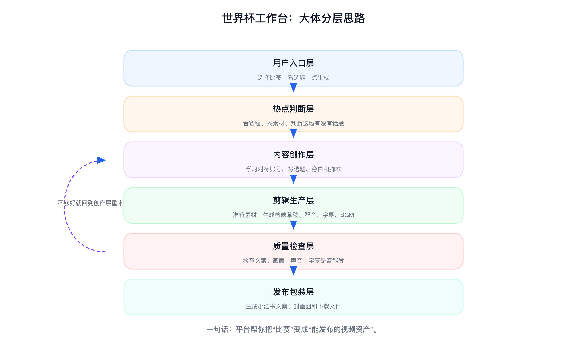
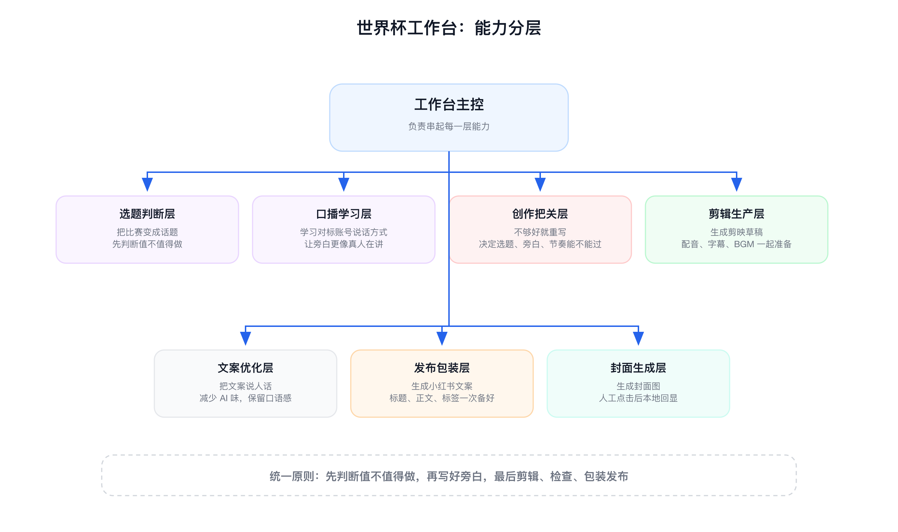

# 世界杯热点视频工作台

一个面向短视频创作者的世界杯内容生产工作台。

它的目标很简单：即使你不懂球，也可以先选择一场比赛，让 AI 帮你判断这场比赛有没有看点，再生成选题、旁白、剪辑脚本、剪映草稿、小红书文案和封面图。

它不是“让 AI 随便写一段解说”。它会先看赛程、找素材、参考对标账号的表达方式，再决定这条内容值不值得做。

## 适合谁

- 想做世界杯热点内容，但不熟悉球队、球员和赛程的人。
- 想批量生成短视频选题、旁白和剪辑思路的人。
- 想把内容直接推进到剪映草稿和小红书发布包装的人。
- 想研究足球短视频账号文案、节奏、标题和封面的人。

## 你能得到什么

- 有冲击力的选题，而不是普通赛前分析。
- 面向观众的旁白文案，而不是把剪辑思路念出来。
- 可执行的剪映草稿脚本。
- AI 配音、字幕、BGM、画面完整性的校验。
- 小红书标题、正文、话题标签和封面图。

## 大体工作方式



一句话理解：平台先判断比赛有没有内容价值，再写好旁白，最后剪辑、检查、包装发布。

## 能力分层



这些能力不是各做各的，而是围绕一个目标：让一场比赛变成一条能发布、有人愿意看的短视频。

## 快速上手

### 1. 安装依赖

```bash
npm install
```

### 2. 启动工作台

```bash
npm run dev
```

打开页面：

```text
http://localhost:5173
```

### 3. 选择比赛

在页面里选择最近的世界杯赛程。推荐从未来比赛里选，这样更适合做赛前热点、预测、爆冷、球星看点。

### 4. 生成选题和内容包

点击生成后，工作台会尝试完成：

- 找比赛相关素材和热点信号。
- 生成多个短视频选题。
- 过滤掉不够吸引人的选题。
- 为通过的选题生成旁白、剪辑节奏和发布思路。

### 5. 生成剪映草稿和小红书发布资产

确认选题后，可以继续生成：

- 剪映草稿脚本。
- 字幕文件。
- AI 配音和 BGM 配置。
- 小红书发布文案。
- 小红书封面图。

封面图是人工点击生成的。剪辑完成后，在工作台里点击“生成封面图”，系统会调用 Codex 的图片生成能力，把封面保存在本机并回显。

## 剪映说明

项目内已放入剪映自动化 skill：

```text
skills/jianying-editor
```

如果你想使用自己的剪映 skill，也可以指定：

```bash
export JY_SKILL_ROOT=/absolute/path/to/jianying-editor-skill
```

Python 环境至少需要：

```bash
python3 -m pip install --user pymediainfo==7.0.1 edge-tts==7.2.3 websockets==15.0.1
```

页面生成剪映计划后，可以直接点击“执行剪映草稿”。后端只允许运行 `runs/` 目录下由本项目生成的脚本。

注意：自动导出更适合 Windows + 剪映专业版 5.9 或更低版本。macOS 当前更适合生成草稿后手动打开剪映检查和导出。

## 命令行玩法

也可以不用页面，直接生成内容包：

```bash
npm run codex:pack -- --topic "France vs Senegal 2002 World Cup shock" --language zh --count 5
```

## 已验证

- `npm run build` 通过。
- `npm run test:quality` 通过。
- `npm run verify:ui` 通过。
- 剪映草稿可生成，并会检查视频轨、旁白轨、字幕轨、BGM、素材权限和画面覆盖。
- 小红书封面图可通过 Codex 内置图片生成能力生成，并保存到本机 `runs/*/publish`。

## 进一步阅读

- [中文平台世界杯热点剪辑调研](docs/platform-research.md)
- [小红书足球热点对标拆解](docs/xiaohongshu-benchmark.md)
- [世界杯脚本 Skill 与验证闭环](docs/script-skill-and-validation-loop.md)
- [Codex 创作代理架构](docs/codex-creative-agent-architecture.md)

## 资料来源

- 剪映 skill：https://github.com/luoluoluo22/jianying-editor-skill
- FIFA 赛程：https://www.fifa.com/en/tournaments/mens/worldcup/canadamexicousa2026/scores-fixtures
- ESPN 赛程快照：https://www.espn.com/soccer/story/_/id/48939282/2026-fifa-world-cup-fixtures-results-match-schedule-group-stage-knockout-rounds-bracket
