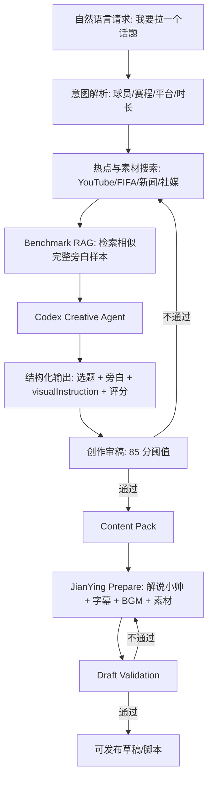

# 足球创作操刀手 Skill 编排

## 目标

把内容生产从“前端表单 + 代码模板”升级为“自然语言创作请求 + Codex 创作代理 + 对标样本检索 + 剪映验证回路”。

新 skill：

- `/Users/airhua/.codex/skills/football-creative-director`

它负责：

- 根据完整旁白样本检索相似对标视频。
- 判断选题是否值得做。
- 选择叙事引擎。
- 写标题、旁白、剪辑 beat、字幕风格、音频策略。
- 对脚本和剪映草稿做风格/完整性校验。

## 编排链路

## 每层职责

### 1. 意图解析

输入可以是一句话：

`我要做 C 罗世界杯最后一舞，小红书 60 秒。`

系统需要解析：

- 主体：C 罗 / 葡萄牙 / 具体赛程
- 平台：小红书 / 抖音
- 内容模式：球星微动作 / 情绪故事 / 争议解释 / 原声辅助
- 输出：选题、脚本、剪映草稿或完整成片链路

### 2. 热点与素材搜索

代码层负责搜索，不负责写内容：

- YouTube/FIFA 高光和前瞻。
- 新闻/RSS 当前热点。
- 后续可加入小红书/抖音/微博热点。

输出给 Codex：

- `assets`
- `hotspotSignals`
- `riskFlags`
- `rightsNote`

### 3. Benchmark RAG

每次创作都必须根据当前话题检索样本，而不是只使用总画像。

当前接入：

- 脚本：`/Users/airhua/.codex/skills/football-creative-director/scripts/retrieve_benchmark_examples.py`
- 调用点：[server/creative-agent.ts](/Users/airhua/Documents/world-cup/server/creative-agent.ts)

返回内容：

- 样本 ID、标题、来源。
- 类型：问题解释、反转揭示、人物关系、球星微动作等。
- 开头/中段/结尾学习点。
- 完整本地旁白路径。
- 可迁移结构。

Codex 只能迁移机制，不能复制长文案。

### 4. Codex Creative Agent

Codex 负责创作：

- 从热点和素材中提炼真正话题。
- 选择叙事引擎。
- 写选题、hook、reason。
- 写完整 `voiceover`。
- 写剪辑执行用 `visualInstruction`。
- 给 `preflight` 和 `viralScore`。

TypeScript 只负责调度、schema、过滤、缓存、降级。

### 5. 创作审稿

创作分低于 85，不展示或重写。

新增 skill 脚本：

- `/Users/airhua/.codex/skills/football-creative-director/scripts/score_creative_pack.py`

它检查：

- 旁白长度是否适配模式。
- 是否泄漏剪辑思路。
- 是否有 AI 连接词。
- 开头是否能停住人。
- 是否有可见证据和事实锚点。
- 是否有样本引擎、证据类型、旁白模式。
- 字幕句长是否适合手机。
- 音频模式是否匹配原声/旁白策略。

### 6. 剪映验证

当前代码已在 [server/pipeline.ts](/Users/airhua/Documents/world-cup/server/pipeline.ts) 增强：

- `creative-benchmark-engine`
- `creative-benchmark-evidence`
- `creative-subtitle-readable`
- `creative-mode-audio-plan`
- `bgm-volume`

草稿必须验证：

- 视频轨道。
- `VoiceOver` 旁白轨。
- `BGM` 轨道和低音量。
- 字幕轨道、字幕位置。
- 原视频音量压低。
- 素材文件存在且在草稿目录内。
- 画面覆盖口播。
- 旁白/字幕数量匹配。
- 创作分 85+。

## 降级约束

`deterministic_fallback` 只能保证页面不空白。

如果出现 fallback：

- 必须在 `warnings` 和 `trace` 标记。
- 不视为目标创作效果。
- 不应该拿 fallback 结果判断文案能力。

## 下一步建议

- 把前端从表单改成自然语言创作驾驶舱。
- UI 展示本轮使用的 benchmark 样本 ID 和隐藏选题原因。
- 把 `score_creative_pack.py` 的结果写入 API response，形成可见审稿报告。
- 剪映失败时让 Codex 根据 validation checks 重新生成 `visualInstruction`，而不是只重跑脚本。
